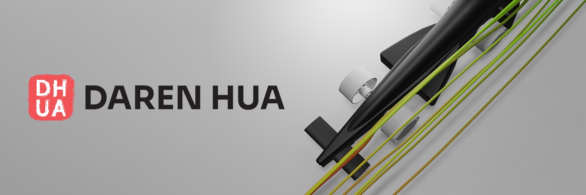

Welcome to my profile!

My name is Daren Hua, a fullstack engineer and a computer science student at Hamilton College. I find magic in the endless solutions and beauty created by software, especially when used to merge disciplines. I'm currently searching for software engineering internship oppertunities for Summer 2024!

Want to read about my projects? [Check out my portfolio!](https://darenhua.netlify.app/)

## &#x1f4c8; Most Used Languages

 

 
 

## 📌 Check out these repos!

 

 

 

 

 
 
